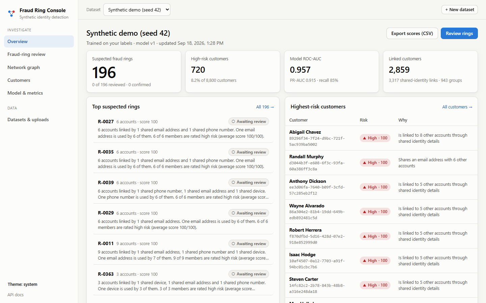
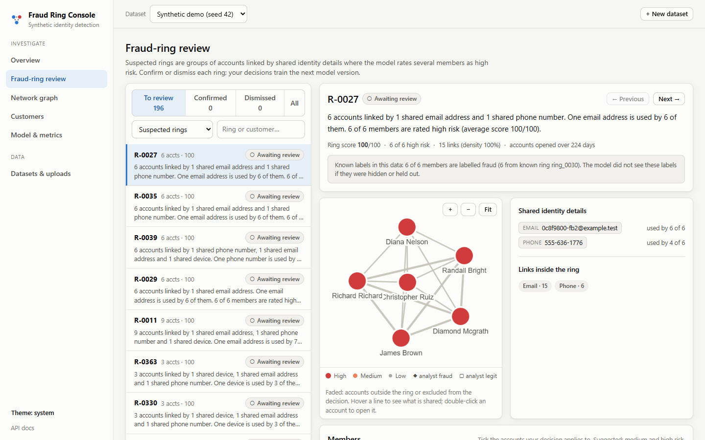
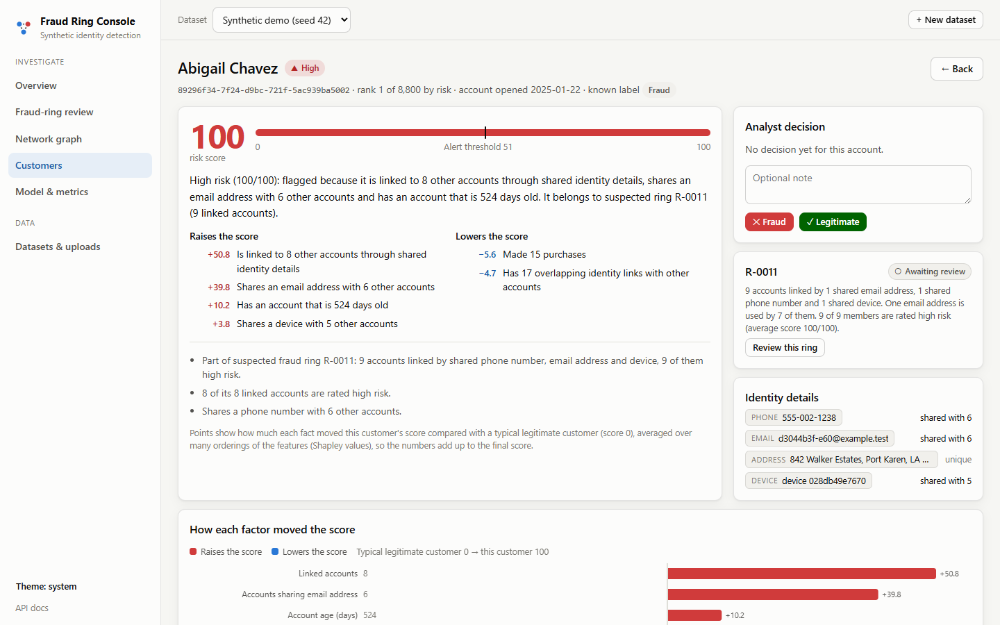
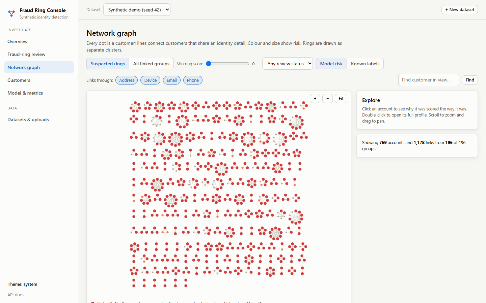
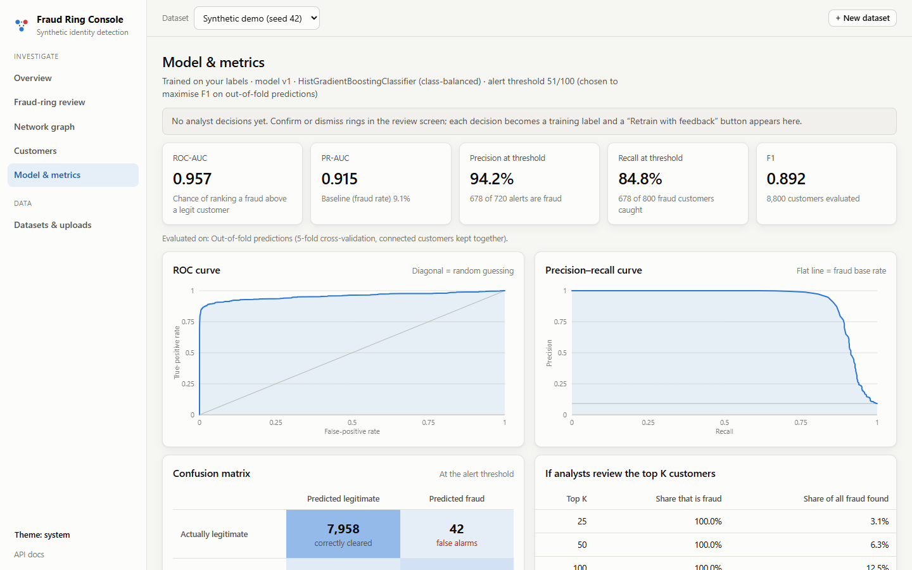

# Synthetic Identity Fraud Detection

Fraud rings build synthetic identities and reuse the same phone numbers, emails, addresses and devices across many fake accounts. This project detects those rings. It generates a realistic synthetic dataset, builds a customer identity graph from shared attributes, trains models on network and behaviour features, and ships an **analyst console**. The console scores every customer, explains each score in plain English, surfaces suspected fraud rings for review, and feeds analyst decisions back into the model.

It also works on **your own data**. Upload a CSV in whatever format you have and the app detects the columns, links customers through shared identifiers, and shows the fraud rings, even without fraud labels.



## Contents

- [Quick start](#quick-start)
- [Using your own data](#using-your-own-data)
- [What the console does](#what-the-console-does)
- [How it works](#how-it-works)
- [Results](#results)
- [Research pipeline](#research-pipeline)
- [Stretch goal: contrastive pretraining](#stretch-goal-contrastive-pretraining)
- [Testing](#testing)
- [Demo script](#demo-script)
- [Future work: temporal modelling (deferred)](#future-work-temporal-modelling-deferred)
- [Project layout](#project-layout)

## Quick start

Requirements: Python 3.11+, Node.js 20.19+ (only to build the frontend).

```bash
python -m venv venv
venv\Scripts\activate            # macOS/Linux: source venv/bin/activate
pip install -r requirements.txt

cd frontend
npm install
npm run build                    # creates frontend/dist, served by the backend
cd ..

python -m backend                # open http://127.0.0.1:8000
```

The first screen offers two paths: **Generate and analyse** (the synthetic demo, about a minute) or **Upload a CSV**. To have data ready before a demo, preload it from the command line:

```bash
python -m backend.cli demo                                   # synthetic dataset, seed 42
python -m backend.cli analyze sample_data/bank_customers_unlabeled.csv --name "Bank export"
python -m backend.cli list
```

**Development mode** (hot reload for both halves):

```bash
python -m backend --reload       # API on :8000
cd frontend && npm run dev       # UI on http://localhost:5173 (proxies /api to :8000)
```

Interactive API docs are at `http://127.0.0.1:8000/docs`. Everything the app stores (SQLite database, uploads, generated datasets) lives in `storage/`, which is git-ignored; delete the folder to start fresh, or set `FRAUD_APP_STORAGE` to use another location.

## Using your own data

Upload on **Datasets & uploads** (or use `python -m backend.cli analyze file.csv`).

| File | Required | Shape |
|---|---|---|
| Customers | yes | One row per customer. Any column names. |
| Account events | no | One row per event: customer ID and date; optionally event type, credit utilization and credit limit. |
| Identity links | no | Long format: customer ID, attribute type (`phone`, `email`, …), attribute value. This is the format of `data/raw/customer_attribute_links.csv`. |

**Column roles are detected automatically** from names and values, and you can change any of them before running:

| Role | Examples it recognises | Used for |
|---|---|---|
| Customer ID | `customer_id`, `Client ID`, `CUST_NO` | Row identity; duplicate IDs are merged. |
| Phone / email / address / device / IP / national ID / bank account / other identifier | `Mobile Number`, `E-mail`, `Street Address` + `City` + `ZIP`, `Device ID`, `ip_address`, `SSN`, `IBAN` | Linking customers into the identity graph. |
| Fraud label | `is_fraud`, `Fraud Flag` with 1/0, yes/no, true/false, fraud/legit | Training or evaluation (your choice). |
| Known ring ID | `ring_id`, `Ring Ref` | Evaluation only, never a feature. |
| Account open date | `account_open_date`, `signup_date` | Derives account age. |
| Numeric feature | `annual_income`, `credit_score`, `$45,000` | Model input when you train on your labels. |

Identity values are **normalised before matching**:
- Phone numbers are compared by digits, so `(555) 123-4567` matches `+1 555.123.4567`.
- Emails and addresses are compared case-insensitively, and addresses are abbreviated (`Street` → `st`).
- Placeholders such as `N/A`, `unknown` or `000-000-0000` are dropped.
- National IDs and bank accounts are stored as hashes and shown masked.

Split address columns (street, city, state, ZIP) are combined into one address. A city on its own is never used as a link. Any value shared by more than 50 customers, such as an office address or a placeholder, is reported and **not** turned into links, because that would glue unrelated people into one giant "ring".

**Labels are optional.**
- **No label column:** customers are scored by a model trained on the synthetic reference dataset, using exactly the kinds of data your file has. For example, if your file has phone and email but no device, the reference model is retrained on phone and email features only. Rings are still found from your identity graph.
- **Label column, "train" mode:** a model is trained on your labels. Scores are out-of-fold from ring-aware cross-validation, so no customer is scored by a model that saw its own label.
- **Label column, "evaluate only" mode:** labels are hidden from the model and used only to report how well it did.

Analyst decisions become training labels in every mode.

**Sample files** in a deliberately different format live in [`sample_data/`](sample_data). They come from a different synthetic population (seed 7, 1,650 customers) and have messy phone formats, split addresses, `$` incomes, Yes/No labels and a 60-person office address. The upload page can load them with one click. Regenerate them with `python -m scripts.make_sample_data`.

## What the console does

| Page | What you get |
|---|---|
| **Overview** | Suspected rings, high-risk count, model quality, risk-score distribution with the alert threshold, what drives the scores, ring-detection accuracy against known labels, top rings and customers, data-quality notes. |
| **Fraud-ring review** | Queue of suspected rings, highest score first. Each ring shows a plain-English summary, an interactive graph, the exact shared values ("email `x@…` used by 6 of 6"), members with risk and reasons, and per-member tick boxes. **Confirm** or **Dismiss** with an audit note; the queue auto-advances to the next ring. |
| **Network graph** | All suspected rings (or all linked groups) as an interactive graph. Filter by ring score, link type and review status; colour by model risk or known labels; click for details, double-click to open a customer. |
| **Customers** | Searchable, sortable, paginated list with each customer's main reason. |
| **Customer detail** | Risk score against the threshold, a plain-English explanation, a factor chart showing how each fact moved the score, a connection graph, linked accounts with the exact shared values, identity details, account activity over time, all feature values, and an analyst decision. |
| **Model & metrics** | ROC and precision-recall curves, confusion matrix, precision/recall for the top K, the feature-set comparison (profile vs network vs behaviour), feature importance, graph statistics, and the model version history with a like-for-like comparison after each retrain. |
| **Datasets & uploads** | Upload wizard with column mapping, synthetic generator, dataset list and recent jobs. |

Jobs report **live progress** stage by stage (Server-Sent Events with a polling fallback). **Retrain with feedback** appears as soon as there are new review decisions; ring IDs stay the same across versions. Scores can be exported as CSV.

<p>
  
  
</p>
<p>
  
  
</p>

## How it works

```
upload / generate ──► ingest & normalise ──► identity graph ──► features ──► model ──► explanations
                                                                  │                         │
                                   analyst decisions ◄── ring review ◄── ring detection ◄────┘
                                          │
                                          └──► retrain (new model version) ──► SQLite ──► React console
```

| Stage | Code | Notes |
|---|---|---|
| Ingest | `backend/pipeline/ingest.py` | Column-role detection, value normalisation, canonical customers / links / events. |
| Identity graph | `src/data/build_customer_graph.py` | Customers sharing any attribute value are linked; per-type flags on every edge. |
| Features | `src/data/generate_red_flag_features.py`, `src/data/generate_temporal_features.py` | Network red flags (shared phone/email/address/device counts, degree) and behaviour over time (event bursts, utilization spikes, gaps). Both are vectorised and produce exactly the same values as the original implementations. |
| Model | `backend/pipeline/modeling.py` | Class-balanced `HistGradientBoostingClassifier`. **Supervised mode:** out-of-fold scores from 5-fold `StratifiedGroupKFold` (known rings or connected components kept together), plus the research experiment table. **Transfer mode:** a model trained on the synthetic reference dataset with the same feature definitions as the upload, plus analyst labels weighted 5×. The alert threshold maximises F1. |
| Explanations | `backend/pipeline/explain.py` | **Baseline Shapley values**, estimated by permutation sampling with antithetic orders. Each factor's contribution is how much it moved the score away from a typical legitimate customer, and contributions add up exactly to the score. Contributions become sentences with the customer's real values: *"High risk (100/100): flagged because it is linked to 8 other accounts through shared identity details, shares an email address with 6 other accounts…"*. Graph context (ring membership, how many linked accounts are high risk, analyst decisions) is added. |
| Rings | `backend/pipeline/rings.py` | Connected groups of linked customers (groups above 30 are split with Louvain). A group is a **suspected ring** when at least two members are high risk or the average member risk is above the threshold. Ring IDs depend only on the graph, so they are stable when the model is retrained. |
| Jobs & API | `backend/jobs.py`, `backend/main.py` | Background worker with per-stage progress in SQLite; FastAPI REST API and an SSE stream per job. |
| Database | `backend/db.py` | SQLite: datasets, jobs, model runs (all metrics), customers (score, explanation, features, identity details), edges, rings, reviews, events. |
| Frontend | `frontend/` | React + TypeScript + Vite. The graph uses Cytoscape.js (fcose for single networks, a packed-ring layout for hundreds of separate rings). Charts are hand-built SVG with hover tooltips. Light and dark themes. |

**Feedback loop.** A confirmed ring labels its ticked members as fraud; a dismissal labels them legitimate; the latest decision wins. Retraining creates a new model version.
- **Transfer mode:** the labels are added to the reference training data.
- **Supervised mode:** the labels override the dataset's own labels.

Each version records how many customers changed risk level and which rings became or stopped being suspected. It also re-scores the previous version on exactly the same customers, so version-to-version metrics are like-for-like.

## Results

### Research experiments (synthetic dataset, ring-aware 80/20 split)

Test set: 1,776 customers including 180 fraud customers. The same table is reproduced by the app for any labelled dataset.

| Model | Feature set | Accuracy | Precision | Recall | F1 | ROC-AUC | PR-AUC |
|---|---|---:|---:|---:|---:|---:|---:|
| Random Forest | Tabular | 0.8682 | 0.1029 | 0.0389 | 0.0565 | 0.4911 | 0.1002 |
| HistGradientBoosting | Tabular | 0.7095 | 0.0922 | 0.2111 | 0.1284 | 0.4746 | 0.0965 |
| Random Forest | Tabular + Network | 0.9623 | 0.8509 | 0.7611 | 0.8035 | 0.9153 | 0.8373 |
| HistGradientBoosting | Tabular + Network | 0.9600 | 0.8263 | 0.7667 | 0.7954 | 0.9184 | 0.8398 |
| Random Forest | Tabular + Temporal | 0.9482 | 0.8929 | 0.5556 | 0.6849 | 0.7888 | 0.6575 |
| HistGradientBoosting | Tabular + Temporal | 0.9403 | 0.7500 | 0.6167 | 0.6768 | 0.7853 | 0.6816 |
| Random Forest | Combined | 0.9707 | 0.9051 | 0.7944 | 0.8462 | 0.9396 | 0.8915 |
| HistGradientBoosting | Combined | 0.9747 | 0.8947 | 0.8500 | 0.8718 | 0.9457 | 0.9074 |

Profile data alone (income, credit score, tenure) is no better than chance. The identity network carries most of the signal, and behaviour over time adds more. Accuracy is misleading on this imbalanced problem: the tabular Random Forest scores 0.87 accuracy while catching 7 of 180 frauds.

### In the app

| Dataset | Mode | ROC-AUC | PR-AUC | Suspected rings | Ring quality vs known labels |
|---|---|---:|---:|---:|---|
| Synthetic demo (8,800 customers) | Trained on labels (out-of-fold) | 0.957 | 0.915 | 196 of 943 linked groups | 94.4% are mostly fraud; 88.9% of the 216 true rings found |
| Bank sample, labels hidden (1,650) | Reference model | 0.948 | 0.896 | 32 of 170 | 87.5% are mostly fraud; 82.9% of the 35 true rings found |
| Bank sample, no labels at all (1,650) | Reference model, no events | – | – | 33 of 170 | – |

At the alert threshold on the synthetic demo, 678 of 720 alerts are fraud (94.2% precision) and 678 of 800 fraud customers are caught (84.8% recall).

**Feedback helps, measured fairly.** On the bank sample with labels hidden, a simulated analyst reviewed the 60 highest-scoring linked groups, deciding each one from the known labels. After retraining, both versions were scored on the customers nobody reviewed:

| | ROC-AUC | PR-AUC | F1 |
|---|---:|---:|---:|
| Before feedback (v1) | 0.738 | 0.456 | 0.424 |
| After feedback (v2) | 0.768 | 0.490 | 0.471 |

Absolute numbers are lower than in the table above because the unreviewed remainder is the hard cases.

## Research pipeline

The original, script-based experiment pipeline is unchanged in behaviour and still runs on its own:

```bash
python -m data_generation.run_all
python -m src.data.split_data
python -m src.data.build_customer_graph
python -m src.data.generate_red_flag_features
python -m src.data.generate_temporal_features
python -m src.data.validate_graph
python -m src.models.random_forest_baseline
pytest -q
```

| File | Purpose |
|---|---|
| `data/raw/customers.csv` | Customer profiles, fraud label and ring ID (ground truth). |
| `data/raw/phones.csv`, `emails.csv`, `addresses.csv`, `devices.csv` | Identity attribute values. |
| `data/raw/customer_attribute_links.csv` | Customer-to-attribute links used to build graph edges. |
| `data/raw/events.csv` | Account events (purchases, payments, limit increases, bust-outs). |
| `data/raw/ring_ground_truth.csv` | Ring membership, for validation. |
| `data/processed/train.csv`, `test.csv` | Ring-aware split (no ring in both). |
| `data/processed/customer_edges.csv` | Customer graph edges with shared-attribute flags. |
| `data/processed/customer_features.csv` | Network red-flag features. |
| `data/processed/customer_temporal_features.csv` | Behaviour-over-time features. |
| `outputs/models/rf_baseline/` | Metrics, predictions and feature importances. |

**How the synthetic data is made.**
- Legitimate customers share attributes for plausible reasons: households share addresses (and sometimes a phone or device), and contact pairs share a phone.
- Fraud rings (2–10 members) share one to three attribute types, each member probabilistically, so rings are not perfect cliques.
- Some fraud customers also share an attribute with a legitimate customer.
- Only 60% of fraud customers show bust-out behaviour, and some legitimate customers have utilization spikes, so behaviour overlaps between the classes.

`generate_all()` accepts `seed`, `n_legitimate`, `n_fraud`, `out_dir` and `progress`; the defaults reproduce the canonical dataset byte for byte.

**Leakage controls.** `is_synthetic_fraud`, `ring_id` and `group_id` are never features. Splits keep each ring on one side, and tests check that no customer or ring appears in both. The graph is built from the full identity universe, which is a transductive assumption; see future work.

## Stretch goal: contrastive pretraining

`src/models/contrastive_pretraining.py` adds a GRACE-style **graph contrastive learner**, which uses no labels:
- Two random views of the identity graph are made by dropping edges and masking features.
- A 2-layer GCN embeds every customer in both views.
- An NT-Xent loss pulls the two views of the same customer together and pushes different customers apart.

The 32-dimensional embeddings are appended to the existing features and evaluated on the same ring-aware split.

```bash
pip install -r requirements-contrastive.txt --index-url https://download.pytorch.org/whl/cpu
python -m src.models.contrastive_pretraining          # about 4 minutes on CPU (3 seeds)
```

Mean ± standard deviation over seeds 42, 43 and 44:

| Model | Features | Precision | Recall | F1 | ROC-AUC | PR-AUC |
|---|---|---:|---:|---:|---:|---:|
| HistGradientBoosting | Combined (baseline) | 0.895 | 0.850 | 0.872 | 0.946 | 0.907 |
| Logistic regression (linear probe) | Embeddings only | 0.518 ± 0.012 | 0.800 ± 0.010 | 0.628 ± 0.007 | 0.930 ± 0.004 | 0.817 ± 0.015 |
| HistGradientBoosting | Embeddings only | 0.923 ± 0.013 | 0.732 ± 0.009 | 0.816 ± 0.004 | 0.931 ± 0.011 | 0.846 ± 0.013 |
| HistGradientBoosting | Combined + embeddings | 0.950 ± 0.024 | 0.794 ± 0.006 | 0.865 ± 0.011 | 0.950 ± 0.003 | 0.898 ± 0.007 |
| Random Forest | Combined + embeddings | 0.931 ± 0.003 | 0.696 ± 0.009 | 0.797 ± 0.005 | 0.942 ± 0.003 | 0.861 ± 0.006 |

**Reading.** Embeddings learned **without any labels** reach ROC-AUC 0.93, about 98% of what the hand-engineered network and behaviour features achieve. That is useful for data where nobody has engineered red flags. Added on top of the hand-engineered features, they raise precision and ROC-AUC slightly but lower recall, F1 and PR-AUC, so on this dataset they are not a clear win. The bolt-on is kept as an optional experiment and the app does not use it.

## Testing

```bash
pytest -q                          # about 4 minutes; the contrastive tests are skipped without PyTorch
cd frontend && npm run typecheck   # strict TypeScript
```

The tests cover:
- **Research pipeline:** determinism, data validation, and leakage.
- **Refactored feature code:** it matches the original implementations exactly.
- **Ingestion:** role detection and normalisation on a foreign schema, and upload validation errors.
- **Explanations:** Shapley contributions add up to the score, and the written reasons name the largest factor.
- **End-to-end through the API:** unlabeled upload → rings → review → retrain → version 2 with stable ring IDs; labels hidden vs trained on; the synthetic job reproducing the research table.
- **Jobs:** the SSE stream, CSV export, and recovery of jobs interrupted by a restart.

## Demo script

About 7 minutes. Preload with `python -m backend.cli demo` and `python -m backend.cli analyze sample_data/bank_customers_unlabeled.csv --name "Bank export (no labels)"`, then `python -m backend`.

1. **Overview (synthetic demo).** 196 suspected rings out of 943 linked groups. The model has ROC-AUC 0.957, and 94% of suspected rings are real rings. Point at the risk histogram: most customers score near 0, and known fraud piles up at 100.
2. **Model & metrics.** The feature-set comparison: profile data alone is at chance (0.49), the identity network lifts it to 0.92, and everything combined reaches 0.95. Accuracy would have hidden this.
3. **Fraud-ring review.** Open the top ring and read the one-line summary: "6 accounts linked by 1 shared email address and 1 shared phone number…". Show the evidence panel with the exact email used by 6 of 6 members, and the graph. Confirm it with a note; the queue advances to the next ring.
4. **Customer detail.** Open a member. The summary says in plain English why it was flagged. The factor chart shows each fact's points, and they add up from a typical customer's score to this one's. Show the connections table with the exact shared phone, email and device. For a bust-out account, the activity chart shows the utilization spike just before the account went quiet.
5. **Your own data.** On Datasets & uploads, click **Unlabeled sample**, then **Upload and detect columns**. Every column is recognised even though the names differ, and the four address columns are combined. Run it and watch the live progress, stage by stage.
6. **Rings without labels.** The same console now shows rings in data that has no fraud labels. Note that the 60-person office address was ignored, not flagged as a ring.
7. **Feedback loop.** Confirm one ring and dismiss another, then click **Retrain with feedback**. Model v2 appears in the version history with what changed, and the ring keeps its ID and status.

## Future work: temporal modelling (deferred)

Time-based modelling was explicitly deferred. The current system is **transductive and static**:
- The identity graph uses every link in the data regardless of when it appeared.
- Behaviour features summarise each customer's whole history.
- Labels are end states.

That is fine for finding rings in a snapshot, but it overstates how early fraud can be caught. A clearly scoped next step:

1. **Timestamped links.** Record when each customer–attribute link first appeared (application or login time). The generator already has account-open dates; links need their own timestamps.
2. **Point-in-time graph snapshots.** Compute network features for a customer using only links that existed at the scoring time, for example at application or 30 days after opening.
3. **Point-in-time behaviour features.** Aggregate events only up to the scoring time, with rolling windows (7/30/90 days) instead of whole-history summaries.
4. **Forward-in-time evaluation.** Train on customers who opened accounts before a cut-off date and test on later ones, still keeping rings on one side, and report how many days before bust-out each ring is flagged.
5. **Sequence and temporal-graph models,** only after 1–4 exist: sequence models over each customer's events, and temporal graph networks over timestamped edges. Compare them against the gradient-boosting baseline on the forward-in-time split.

Success criterion: detection **before** the bust-out, measured as recall at a fixed alert budget N days before the first bust-out event, not end-of-history ROC-AUC.

## Project layout

```
backend/              FastAPI app, job runner, SQLite layer, CLI
  pipeline/           ingest, features, modeling, explanations, rings, reference model, runner
data_generation/      synthetic data generator (customers, identities, rings, events)
src/data/             graph, feature, split and validation scripts (research pipeline)
src/models/           experiment runner and the contrastive pretraining bolt-on
frontend/             React + TypeScript analyst console
sample_data/          "bring your own data" examples in a different format
scripts/              make_sample_data.py
tests/                pytest suite (research pipeline, app end to end, contrastive)
docs/screenshots/     screenshots used in this README
```

Project status and weekly history are in [PROJECT_STATUS.md](PROJECT_STATUS.md).
